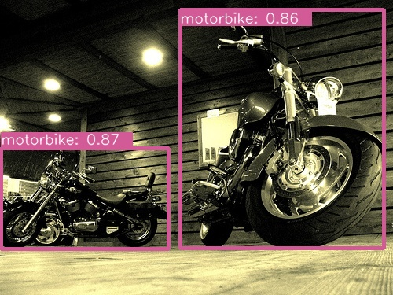
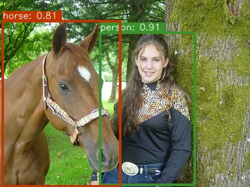
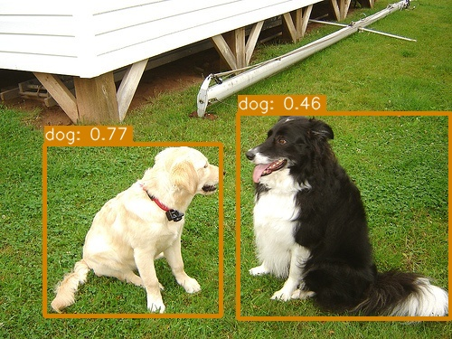
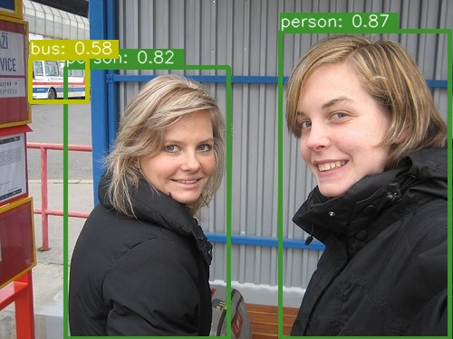
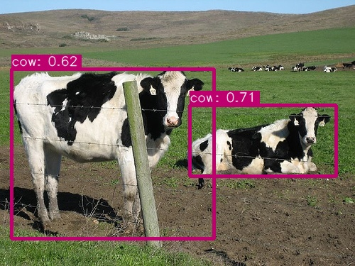
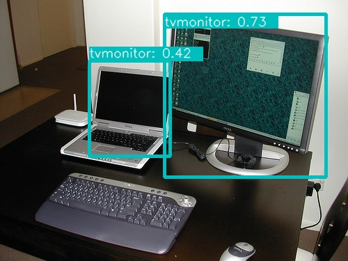
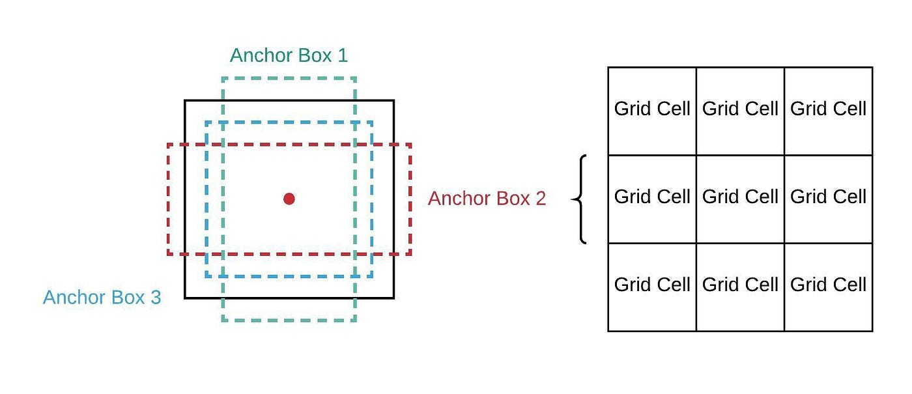
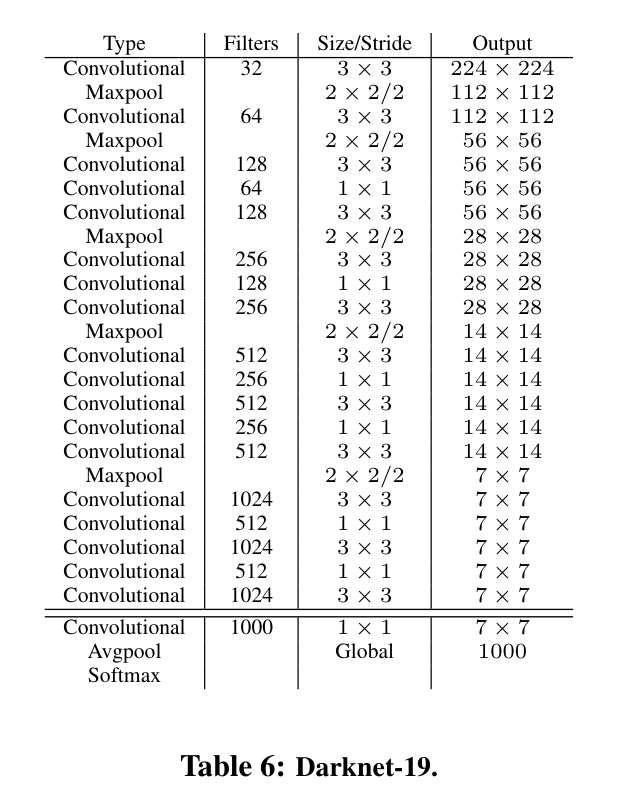
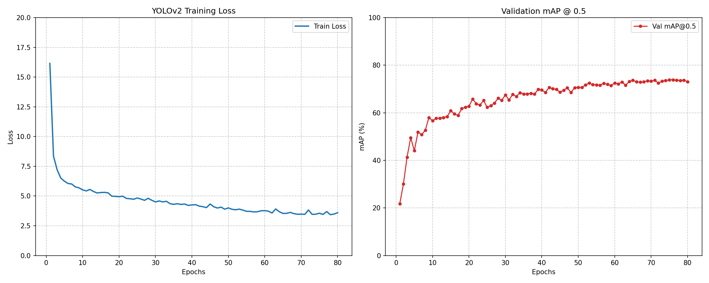

# YOLOv2-VOC

This is a modified **YOLOv2** implementation.

| Model  | Train Dataset                       | Val Dataset  | Epochs | Input Size  | Test Size | mAP@0.5 | mAP@0.6 | mAP@0.75 |
|:-------|:------------------------------------|:-------------|:-------|:------------|:----------|:--------|:--------|:---------|
| YOLOv2 | VOC2007 trainval + VOC2012 trainval | VOC2007 test | 80     | multi-scale | 416x416   | 73.87%  | 66.06%  | 44.44%   |

## Structure

```
├── data/
|   └── VOCdevkit
├── model/
|   ├── __init__.py
|   ├── yolov2_backbone.py
|   ├── yolov2_neck.py
|   ├── yolov2_head.py
|   └── yolov2.py
├── config.py
├── voc.py
├── augmentation.py
├── matcher.py
├── loss.py
├── eval.py
├── train.py
└── test.py
```

<em>Read files in order:</em>
> config.py -> yolov2.py -> voc.py -> augmentation.py -> matcher.py -> loss.py -> eval.py -> train.py -> test.py

## Some Results

<br>
<p align="center">
  
  
  
  <br>
  
  
  
</p>

## What's new?

#### <em>Anchor Boxes</em>:

In YOLOv2 anchor boxes are used. Anchor boxes refer to a set of predefined bounding boxes at each grid cell. Typically,
the anchor boxes placed at all grid cells are the same. Here,
K-means is applied to the dataset to derive five specific anchor boxes for each grid cell. The clustering process
targets only the width and height of the bounding boxes, regardless of
their object categories. This allows the algorithm to automatically 'learn' the ideal anchor dimensions that fit the
dataset.
<br>
<p align="center">
  
  <br>
  <em><strong>Anchor Boxes</strong></em>
</p>

For each bounding box, YOLO still learns the center point offsets, $t_x$ and $t_y$. However, by using the prior size
information from anchor boxes, the network no longer needs to learn the
full width and height of the target. Assuming an anchor box has a width $p_w$ and height $p_h$, and the network outputs
the width and height offsets as $t_w$ and $t_h$, YOLOv2 uses the
following formulas to compute the final center coordinates ($c_x$, $c_y$) and wh $b_w$, $b_h$:

$$b_x = grid_x + \sigma(t_x)$$

$$b_y = grid_y + \sigma(t_y)$$

$$b_w = p_w e^{t_w}$$

$$b_h = p_h e^{t_h}$$

<br>
<p align="center">
  
  <br>
  <em><strong>Location Prediction</strong></em>
</p>

#### <em>Backbone Network</em>:

I used *DarkNet-19* as the backbone network in YOLOv2. First, the DarkNet-19 network is pre-trained on the ImageNet
dataset. After that, the final convolutional layer, global
average pooling layer, and softmax layer which are specific to the classification task are removed. The remaining
architecture then serves as the new backbone for the model.
<br>
<p align="center">
  
  <br>
  <em><strong>DarkNet-19</strong></em>
</p>

#### <em>Ground Truth Matching</em>:

In the previous YOLOv1 implementation, each grid cell output only one bounding box. However, in YOLOv2, each cell is
assigned five anchor boxes, meaning it will produce five predicted boxes. This
necessitates a method to distinguish between positive and negative samples. Specifically, first calculate the IoU
between the five anchor boxes and the ground truth box, denoted as $IoU_{p1}$,
$IoU_{p2}$, $IoU_{p3}$, $IoU_{p4}$ and $IoU_{p5}$, and set an IoU threshold $\theta$. Then three different cases will be
encountered:

- Case 1: All $IoU_p$ values are below the threshold $\theta$. To ensure the training sample is not lost, the anchor box
  with the highest IoU is assigned as the positive sample, participating in the
  calculation of confidence, classification, and bounding box losses.
- Case 2: Only one $IoU_p$ exceeds the threshold $\theta$. Naturally, the predicted box corresponding to this anchor is
  assigned as a positive sample.
- Case 3: Multiple $IoU_p$ values exceed the threshold $\theta$. For instance, if $IoU_{p1}, IoU_{p2},$ and $IoU_{p3}$
  are all above $\theta$, the predicted boxes for $P1, P2,$ and $P3$ are all
  marked as positive. As a result, a single target can be matched with multiple positive samples.

## Train

To start training, run the command -

```
python train.py
```

I used Automatic Mixed Precision (AMP) to accelerate the training process and reduce memory consumption without
sacrificing numerical precision. Furthermore, I used a Cosine Annealing scheduler with a linear warm-up phase during
training. Additionally, Multi-scale Training was implemented, where the input image resolution was randomly sampled
every epoch.

<br>
<p align="center">
  
  <br>
  <em><strong>Loss and mAP@0.5</strong></em>
</p>

## Test

To test your trained model, run the command -

```
python test.py
```

It will randomly select an image in the test set, and then output the model's prediction results. You can also try your
own images!

<br><br>
<em><strong>My pre-trained
model:</strong></em> [YOLOv2](https://drive.google.com/file/d/1dXBM1TQFY-XD7qMQMPVzv9lb8rrBgcHY/view?usp=drive_link)

