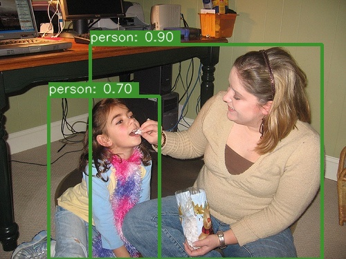
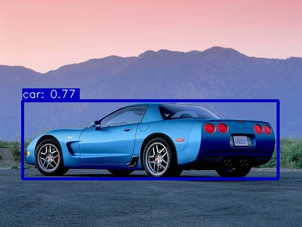
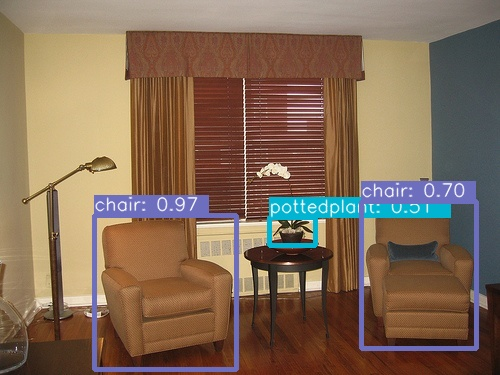
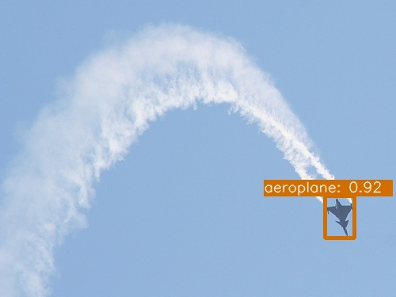
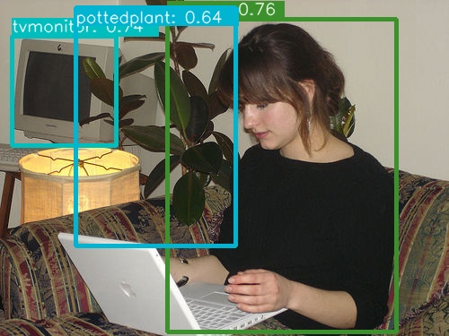
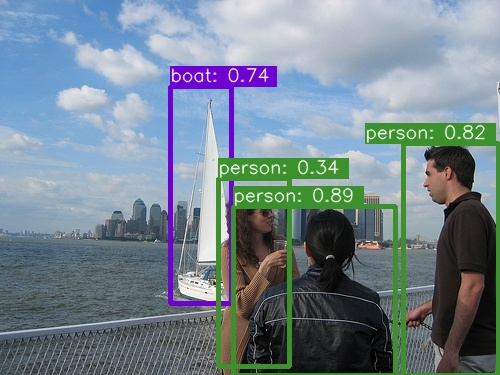
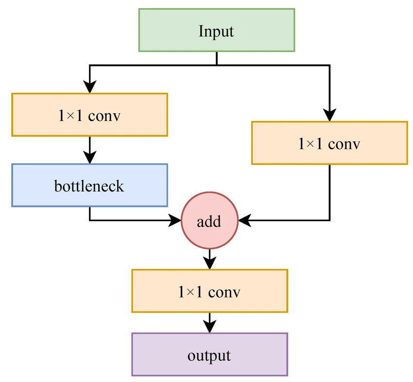
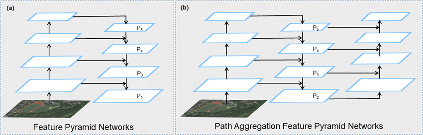
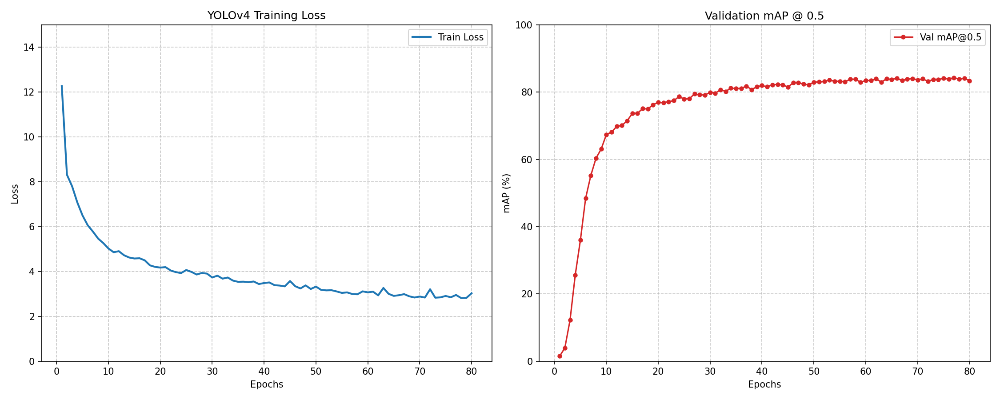

# YOLOv4-VOC

This is a modified **YOLOv4** implementation.

| Model  | Train Dataset                       | Val Dataset  | Epochs | Input Size  | Test Size | mAP@0.5 | mAP@0.6 | mAP@0.75 |
|:-------|:------------------------------------|:-------------|:-------|:------------|:----------|:--------|:--------|:---------|
| YOLOv4 | VOC2007 trainval + VOC2012 trainval | VOC2007 test | 80     | multi-scale | 416x416   | 84.32%  | 79.66%  | 63.55%   |

## Structure

```
├── data/
|   └── VOCdevkit
├── model/
|   ├── __init__.py
|   ├── yolov4_backbone.py
|   ├── yolov4_neck.py
|   ├── yolov4_pafpn.py
|   ├── yolov4_head.py
|   └── yolov4.py
├── config.py
├── voc.py
├── augmentation.py
├── matcher.py
├── loss.py
├── eval.py
├── train.py
└── test.py
```

<em>Read files in order:</em>
> config.py -> yolov4.py -> voc.py -> augmentation.py -> matcher.py -> loss.py -> eval.py -> train.py -> test.py

## Some Results

<br>
<p align="center">
  
  
  
  <br>
  
  
  
</p>

## What's new?

#### <em>Backbone Network</em>:

YOLOv4 adopts the Cross Stage Partial Network (CSPNet) design to build a more powerful backbone: *CSPDarkNet-53*.  
The core idea of CSPNet is to split the input features into two parts. One part is processed through standard modules
like residual blocks, while the other part remains unchanged as an identity
mapping. Finally, the two branches are concatenated along the channel dimension.
<br>
<p align="center">
  
  <br>
  <em><strong>CSP Block</strong></em>
</p>

This design is based on the fact that feature maps in CNNs are often redundant, with many channels carrying similar
information. The CSPNet authors found that it's not necessary to process all
channels. By processing only a portion and keeping the rest as-is, the model can significantly reduce the computational
load and parameter count without compromising performance.

#### <em>PaFPN</em>:

YOLOv4 uses Path Aggregation Network (PANet) in its neck structure. PANet doesn't just feature a "top-down" fusion which
brings deep-level features down to shallower layers, it also adds a "bottom-up"
path. This means that after the top-down fusion is done, the multi-scale features go through another round of fusion
from bottom to top, allowing information to flow back up from shallow to deep layers.
This setup ensures thorough interaction between information at different scales, though it inevitably increases the
model's computational load and inference time.
<br>
<p align="center">
  
  <br>
  <em><strong>PaFPN</strong></em>
</p>

#### <em>Multi Anchor Strategy</em>:

A key improvement in YOLOv4 is the "multi-anchor" strategy, which aims to match as many positive samples as possible for
each ground truth box during the label assignment stage. Previously, only one
positive sample was matched per target, and others were ignored. YOLOv4, however, treats these "ignored samples" as
positive samples as well. In other words, as long as the IoU between a predicted
box and the ground truth exceeds a given threshold within the grid cell containing the object's center, it is labeled as
a positive sample.

Here, instead of looking only at the specific grid cell where the center point drops, I considered a 3x3 neighborhood
around the cell. This means positive samples are now drawn from a 9-grid area
rather than a single cell. As a result, the number of positive samples for each target is increased nearly nine times,
and this abundance of positive samples will enhance the model's performance.

## Train

To start training, run the command -

```
python train.py
```

I used Automatic Mixed Precision (AMP) to accelerate the training process and reduce memory consumption without
sacrificing numerical precision. Furthermore, I used a Cosine Annealing scheduler with a linear warm-up phase during
training. Additionally, Multi-scale Training was implemented, where the input image resolution was randomly sampled
every epoch.

<br>
<p align="center">
  
  <br>
  <em><strong>Loss and mAP@0.5</strong></em>
</p>

## Test

To test your trained model, run the command -

```
python test.py
```

It will randomly select an image in the test set, and then output the model's prediction results. You can also try your
own images!

<br><br>
<em><strong>My pre-trained
model:</strong></em> [YOLOv4](https://drive.google.com/file/d/16EP2VDL81ruzMHVBokQylRGGDUeXQ_SO/view?usp=drive_link)


